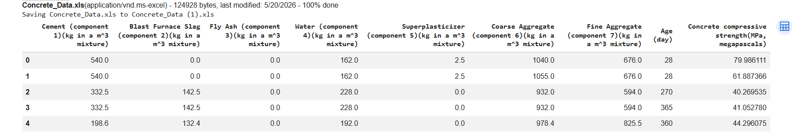
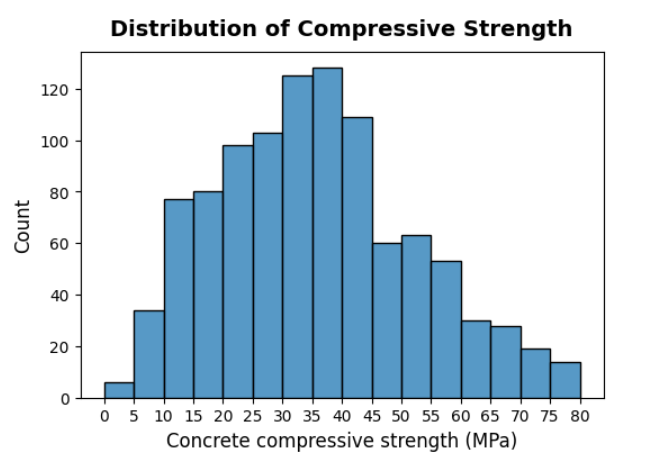
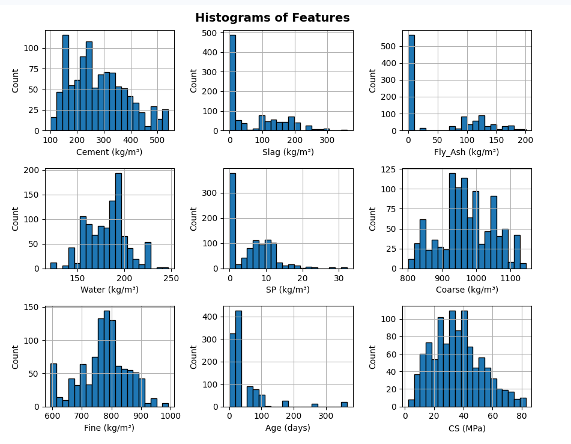
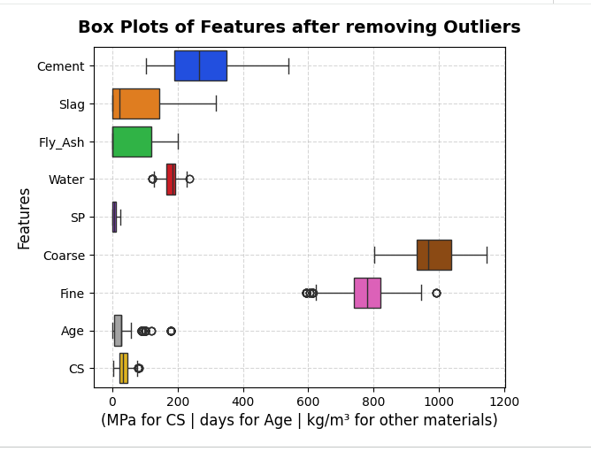
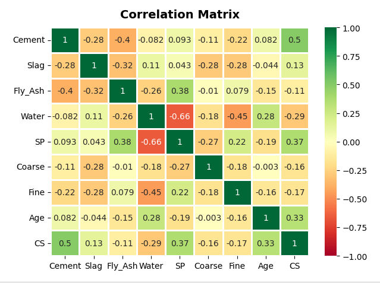
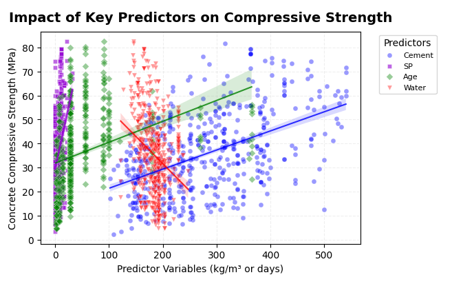

## Exploratory Data Analysis

### Dataset Preview

The dataset contains concrete mix ingredients such as cement, blast furnace slag, fly ash, water, superplasticizer, coarse aggregate, fine aggregate, and age. The target variable is concrete compressive strength measured in MPa.

### Distribution of Concrete Compressive Strength

The distribution shows how concrete compressive strength values are spread across the dataset. Most samples fall within a moderate strength range, while fewer samples have very low or very high compressive strength.

### Feature Histograms

The feature histograms show the distribution of each input variable. This helps understand skewness, concentration of values, and variation across different concrete mix components.

### Box Plots After Outlier Removal

The box plots show the spread of each feature after handling outliers. This step helps reduce the influence of extreme values and improves the quality of the data used for modeling.

### Correlation Matrix

The correlation matrix helps identify relationships between concrete mix components and compressive strength. Cement, age, and superplasticizer show positive relationships with compressive strength, while water shows a negative relationship.

### Impact of Key Predictors

This visualization shows how important predictors such as cement, age, superplasticizer, and water influence concrete compressive strength. Cement and age show positive trends, while water shows a negative relationship with compressive strength.
